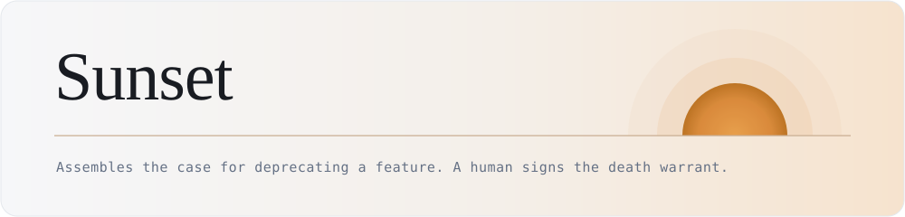
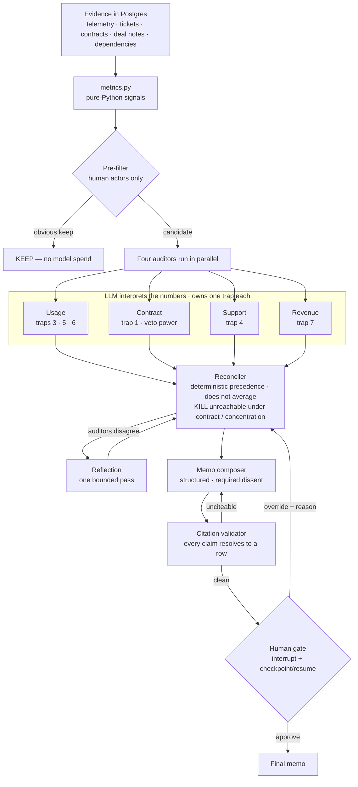
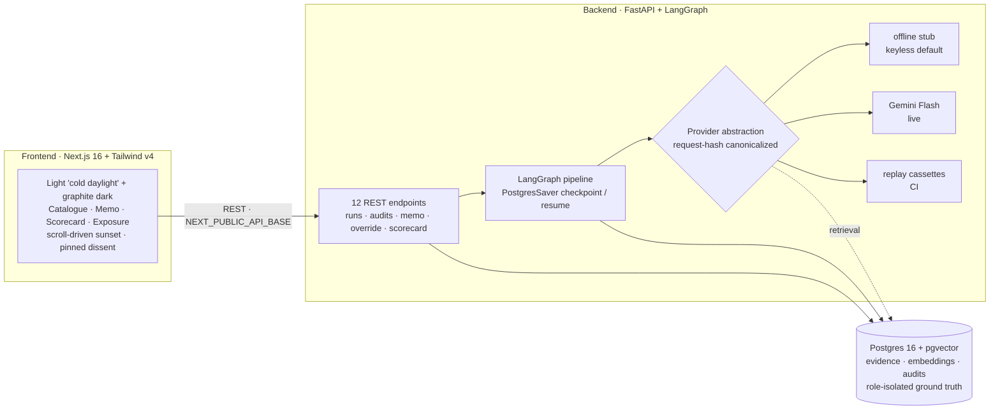
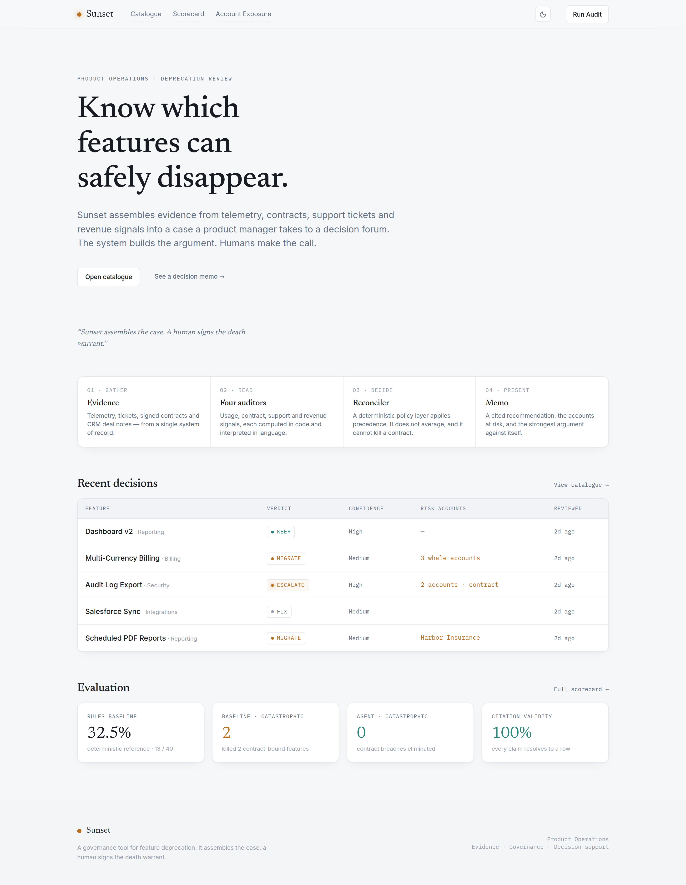
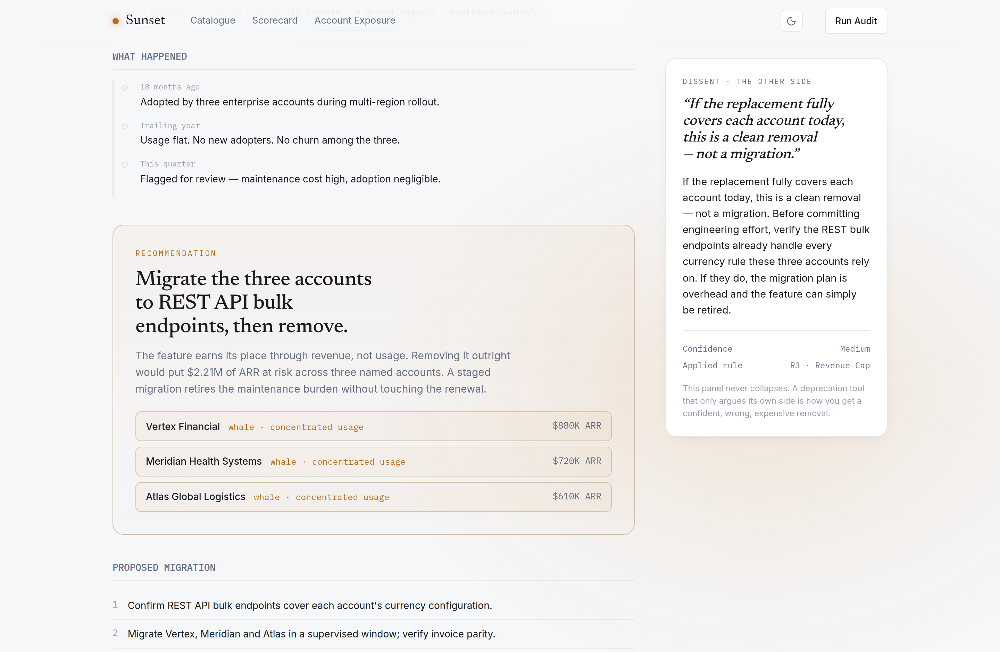
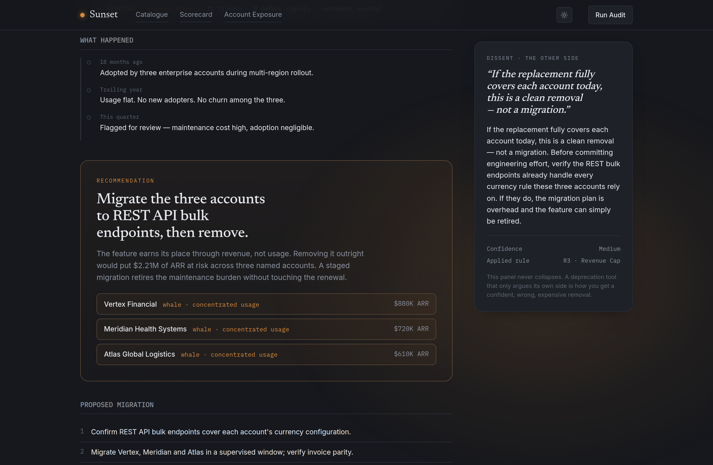
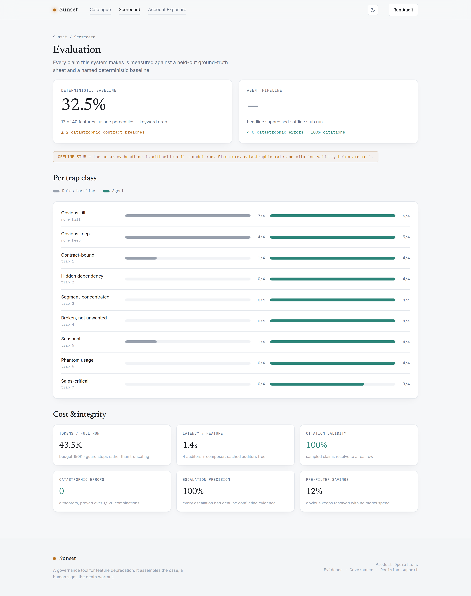

<p align="center">
  
</p>

# Sunset

**Assembles the case for deprecating a software feature — and refuses to make the decision itself.**

> Sunset assembles the case. A human signs the death warrant.

Mature B2B SaaS products accumulate features almost nobody uses. Everyone knows it;
almost nobody removes anything, because the risk is asymmetric. Keeping a dead
feature costs a diffuse amount spread across many quarters and no single owner.
Killing the *wrong* feature costs one specific, nameable enterprise renewal — and
the person who signed off gets named in the post-mortem. So rational individuals
never propose deprecation, and products calcify.

The evidence needed to decide safely is real but scattered across four systems that
don't talk to each other: product telemetry, support tickets, signed contracts, and
CRM notes. Sunset assembles that evidence into a **memo a PM takes to a decision
forum** — with a verdict, its citations, the accounts at risk, and, in a
first-class position, the strongest surviving argument *against* its own verdict.

It never auto-deprecates. That's not hedging — it's the product's core claim. An
agent that autonomously removes product surface based on inferred contract language
is a liability, not a feature.

---

## The one screen that matters: baseline vs. agent, per trap class

The product is not "recommend removing anything under 1% usage" — that's a SQL
query. The product is the set of cases where **low usage is a misleading signal**.
There are seven such traps, and the whole system is built and evaluated around them.

```
                          deterministic       agent pipeline
                          rules baseline      (offline stub*)
  overall accuracy        32.5% (13/40)        * suppressed
  catastrophic KILLs      2 of 12  (breach!)   0 of 11  ✓ zero
  ─ per trap class ─────────────────────────────────────────
  none_kill (obvious)     7/7                  6/7
  none_keep (obvious)     4/5                  5/5
  contract_bound          1/4                  4/4
  hidden_dependency       0/4                  4/4
  segment_concentrated    0/4                  4/4
  broken_not_unwanted     0/4                  4/4
  seasonal                1/4                  4/4
  phantom_usage           0/4                  4/4
  sales_critical          0/4                  3/4
```

The baseline nails the obvious features and **commits two contract breaches**
(it KILLs Data Residency Controls and Scheduled PDF Reports, both contractually
obligated, because their usage looks dead and keyword grep can't read a clause
written in capability language). It scores **0/4 on every genuine trap**.

The agent recovers every trap and drives catastrophic errors to **zero** — the one
metric with an absolute bar. The gap is exactly the traps that need semantic reading
(contract, broken, sales), a structured join the baseline omits (concentration,
phantom), or a graph read (hidden dependency). That is the entire thesis, with
evidence behind it.

\* **About that suppressed number.** This build ships in **offline mode** — a
deterministic stub stands in for the LLM so the whole pipeline runs with no API
key. `eval/score.py` **refuses to print an accuracy headline for a stub run**;
it would be dishonest to screenshot it as a model score. What *is* real and shown
above: the per-trap structure, the zero catastrophic rate, and 100% citation
validity. Drop a free Gemini key into `.env`, set `SUNSET_LLM_MODE=live`, and
`make run` produces the actual model number. See [Running with a real model](#running-with-a-real-model).

---

## The trap taxonomy — this is the product

| # | Trap | The naive error | The signal that catches it | Verdict |
|---|---|---|---|---|
| 1 | **Contract-bound** | Kills a feature named in an MSA/SLA | Clause text (capability language, not feature names) | `ESCALATE` |
| 2 | **Hidden dependency** | Kills a feature that silently powers a used one | Dependency edge from a KEEP feature | `MIGRATE` |
| 3 | **Segment-concentrated** | Kills a feature used by 0.8% of users who are 40% of revenue | Usage joined to ARR band | `MIGRATE` |
| 4 | **Broken, not unwanted** | Reads collapsed usage as lost interest | Defect tickets clustering after the drop | `FIX` |
| 5 | **Seasonal** | Kills a feature dormant ten months a year | Month-of-year periodicity over 24 months | `KEEP` |
| 6 | **Phantom usage** | *Keeps* a dead feature that bots/QA inflate | Actor type on events | `KILL` |
| 7 | **Sales-critical, product-dead** | Kills a feature never used post-signup but cited in won deals | CRM deal notes | `KEEP` + reclassify |

Five verdicts, not two: `KILL`, `MIGRATE`, `KEEP`, `FIX`, `ESCALATE`. Trap 6 is the
only one where the naive error is a false *keep* — a system that only ever says
"don't kill it" is safe and useless. Trap 7 is the hardest: a feature can be dead in
the product and load-bearing in the sale, and the right answer is neither kill nor
keep — it's *keep, reclassify as sales collateral, stop investing*.

---

## How it works



**The design principle throughout:** the LLM gathers and interprets evidence; a
**deterministic policy layer** converts evidence into a risk decision. Letting a
model decide "is this contract breach acceptable" is exactly the boundary an AI PM
is paid to draw. Concretely:

- **`metrics.py` computes every quantitative signal in Python** — trend, 24-month
  seasonality, ARR concentration, bot share, defect-after-drop, dependency weight.
  You never ask a model to compute a seasonality index it can get wrong. It detects
  a usage drop from the series itself; it is never told where the break is.
- **The pre-filter can only KEEP or defer — never KILL.** The cheap path is
  structurally incapable of reaching a catastrophic verdict. It counts *human*
  actors only, so a phantom feature can't be waved through on bot traffic.
- **The reconciler is pure Python, table-driven, and does not average.** It applies
  hard-coded precedence (contract obligation → `ESCALATE`, unoverridable; revenue
  concentration → cap at `MIGRATE`; defect + decline → `FIX`; …). That
  **`KILL` is unreachable under a contract obligation or revenue concentration is a
  theorem**, proved by `tests/test_precedence.py` over all 1,920 signal combinations
  — not an observation about a model.
- **Every factual claim in a memo carries an evidence ref** that resolves to a real
  row; text citations must quote a verbatim substring of the source. A hallucinated
  citation fails the run loudly and never reaches the UI.
- **The dissent is never empty and never collapsible.** A deprecation tool that only
  argues its own side is how you get a confident, wrong, expensive removal.
- **LangGraph earns its place on one thing:** checkpoint-and-resume across the human
  gate. Without human-in-the-loop, plain async Python would do — and the code says so.

---

## Architecture

Three tiers, one database. The frontend is a decision-support UI, not a dashboard;
the backend is a deterministic policy layer wrapped around an LLM interpretation
layer; the store is a single Postgres with `pgvector` — no second datastore.



| Tier | Framework | Why |
|---|---|---|
| **Frontend** | Next.js 16 · React 19 · Tailwind v4 · next-themes · Framer-Motion-style scroll | Editorial, evidence-first UI; self-hosted Newsreader / Inter / IBM Plex Mono via `next/font` |
| **Orchestration** | LangGraph | Earns its place on checkpoint-and-resume across the human gate — nothing else |
| **API** | FastAPI + SQLAlchemy 2.0 | Twelve endpoints; long runs via BackgroundTasks (no Celery, no Redis) |
| **Store** | Postgres 16 + pgvector | One database; ground-truth isolation enforced by a REVOKE'd role |
| **Embeddings** | hashing (keyless default) · Gemini `gemini-embedding-001` (live) | huggingface.co is egress-blocked, so `bge-small` can't download here |
| **LLM** | Gemini Flash · offline stub · replay cassettes | Runs keyless by default; a real key lifts the offline headline suppression |
| **Eval** | plain Python + pytest | A paid eval platform here would be theatre |

---

## The interface

A case file, not a dashboard. Light "cold daylight" is the primary theme; a graphite
dark mode is one toggle away. Amber appears **only** on real business risk — revenue
exposure, at-risk accounts, contract and escalate rows — so when it shows up, it means
something.

<p align="center">
  <br/>
  <em>Landing — editorial, evidence-first.</em>
</p>

<p align="center">
  <br/>
  <em>The signature: on a decision memo the page opens cool and a warm sunset light swells
  behind the recommendation — lighting, not paint — while the dissent stays pinned and
  never collapses.</em>
</p>

<p align="center">
  
  <br/>
  <em>Graphite dark mode · the live evaluation scorecard (baseline vs. agent, per trap).</em>
</p>

The frontend lives in [`frontend/`](frontend/). It renders standalone on typed mock data,
or against the live API when `NEXT_PUBLIC_API_BASE` is set. `cd frontend && npm install && npm run dev`.

---

## Why the evaluation is trustworthy (the anti-circularity protocol)

The most common flaw in agentic portfolio projects: an LLM generates the dataset, an
LLM agent finds the answers, and the system "recovers what was planted." The
evaluation then measures nothing. Sunset is built to survive that one question:

1. **The 40-row ground-truth sheet was hand-written first** (`eval/truth/ground_truth.csv`),
   before any evidence existed. The evidence encodes those verdicts; the verdicts do
   not come from the evidence.
2. **The evidence is generated deterministically from seed 1337** (`datagen/`),
   committed as fixtures so the dataset is reproducible with no key and no network.
3. **The agent physically cannot read the answer key.** Ground truth lives in a
   Postgres schema `truth` owned by a separate role; the app connects as `sunset_app`,
   which is `REVOKE`'d from that schema. `tests/test_isolation.py` proves the denial.
   The agent package also cannot *import* the generator or scorer (AST-checked).
4. **Distractors are deliberate.** A contract names a capability that a safe-to-kill
   feature relates to (but a live replacement satisfies it); two KEEP features carry
   heavy ticket volume that is demand, not defect. The system cannot win by
   pattern-matching "has tickets → fix" or "named in a contract → escalate."
5. **Twelve of the 40 features are a blind holdout**, scored only at phase gates, to
   catch the realistic circularity failure: a developer tuning thresholds against the
   visible score. Thresholds are justified by written rationale, and every change is
   logged in `eval/CHANGELOG.md`.

Gate that had to pass before writing any agent code: pick 10 features at random,
derive the verdict from **raw evidence alone** without opening the sheet, get 10/10.
It did (`datagen/blind_derive.py` dumps evidence with no labels).

---

## Quickstart

Requires Python 3.11+, `uv`, and PostgreSQL 16 server binaries. No API key needed.

```bash
make db-up      # bootstrap a local Postgres 16 + pgvector cluster (no Docker)
make install    # uv sync
make seed       # load committed fixtures + keyless hashing embeddings
make doctor     # green/red preflight

make baseline   # the frozen deterministic baseline: 32.5%, 2 contract breaches
make run        # the full 40-feature agent pipeline (offline stub)
make score      # baseline vs agent, per trap class
make api        # serve the FastAPI app on :8000
make test       # 50 tests
```

`GET /eval/scorecard` puts the evaluation on a live endpoint.
`GET /accounts/{id}/exposure` inverts the product for the CS team — pick an account,
see what it would lose. `POST /audits/{id}/override` resumes the graph from its
checkpoint with a human decision.

---

## Running with a real model

The pipeline is provider-abstracted. To get a real model score:

1. Get a free key at <https://aistudio.google.com/apikey>.
2. In `.env`: `GEMINI_API_KEY=…`, `SUNSET_LLM_MODE=live`, `SUNSET_EMBEDDING_MODEL=text-embedding-004`.
3. `make embed` — generate and commit real Gemini vectors (so later keyless clones
   still get semantic retrieval), then `make run && make score`.

`SUNSET_LLM_MODE=replay` runs committed cassettes with no key (a cassette miss is a
hard error, never a silent live call), so CI stays deterministic and free.

---

## Deploy (backend + frontend)

The frontend reads real audit data from the backend API (catalogue, structured
memos, human overrides, scorecard); it falls back to committed mock data when
`NEXT_PUBLIC_API_BASE` is unset, so the design is always viewable standalone.

Both halves are container-ready — a root `Dockerfile` for the FastAPI backend
(with an idempotent entrypoint that applies the schema, seeds fixtures, runs the
offline pipeline, then serves) and a `frontend/Dockerfile` for the Next.js app.
A one-click **Render** Blueprint (`render.yaml`) brings up all three services
(Postgres + backend + frontend); the step-by-step runbook — plus notes for
Railway and other platforms — is in **[DEPLOY.md](DEPLOY.md)**. The hosted
backend runs the real pipeline in offline mode with no API key; the scorecard
keeps its accuracy headline suppressed until a live model run is configured.

---

## Stack

LangGraph (checkpoint/resume) · FastAPI + SQLAlchemy 2.0 · Postgres + pgvector ·
local hashing embeddings by default, Gemini `text-embedding-004` when keyed ·
Gemini Flash for the auditors · plain-Python + pytest eval harness.
Explicitly rejected: Neo4j (25 edges is an adjacency table), Redis/Celery (one
user), ChromaDB (pgvector is already here), any paid eval tool, any fine-tuning.

---

## Deviations from the spec (flagged, with reasons)

This build is a backend vertical slice. It was built against a detailed PM spec;
where reality or judgment diverged from the letter of the spec, it is documented
rather than silently papered over — that discipline *is* the product.

| Deviation | Reason |
|---|---|
| **24 months of usage, not 18** | 18 months is 1.5 annual cycles; you cannot establish annual periodicity from it. Two full cycles make trap 5 honestly scoreable. |
| **Trap 7 uses a `secondary_action` field, not a 6th verdict** | The spec's own five-verdict vocabulary can't express "keep, reclassify." The reclassification rides alongside `KEEP`, keeping the vocabulary intact. |
| **Ground truth is committed, not hidden** | The agent's read path is the database, not the filesystem. Isolation is enforced where it matters (DB roles + import lint); committing the sheet lets a reviewer audit the golden set. |
| **Embeddings: hashing (default) / Gemini (keyed), not `bge-small`** | This environment's egress policy blocks huggingface.co, so `sentence-transformers` can't download the model. That path is written and documented but untested here. |
| **No Groq comparison arm** | api.groq.com is blocked by egress policy. The provider abstraction supports it as a config swap; it is reported as **not run**, never synthesized. |
| **Pre-filter resolves 12%, not the spec's ~40%** | The eval set is deliberately trap-dense — only 5 features are unambiguously healthy. On a real catalogue with more mundane features, resolution would be higher. |
| **No frontend / cloud deploy** | Out of scope for this slice. The design brief (case-file aesthetic, dissent margin) is captured in the spec for a follow-up. |

### Two honest misses in offline mode

The offline stub scores well but misses two features — **both are hashing-embedder
retrieval-floor artifacts, not logic bugs, and Gemini resolves both**:

- **f01 (Legacy Dashboard v1) → `ESCALATE`** instead of `KILL`. Generic won-deal
  notes praising the *current* dashboard lexically collide with "Legacy Dashboard,"
  producing a spurious sales-critical signal that conflicts with dead usage — so the
  system escalates to a human rather than guessing. That is defensible governance
  behavior; the root cause is retrieval precision, which semantic embeddings fix.
- **f39 (On-Prem Deployment) → missed reclassify.** The hashing embedder can't bridge
  "On-Prem" (feature name) and "on-premises" (deal-note text) — zero shared tokens.
  This is precisely the paraphrase gap a semantic embedder closes.

---

## Cost of a run

One full 40-feature run, offline stub, per-agent tokens (budget: **150K**, and the
`BudgetGuard` stops rather than truncating evidence to fit):

```
  contract     13,214    usage       9,260    support   8,216
  revenue       7,280    composer    5,430    reflection    103
  ───────────────────────────────────────────────────────────
  total ~43,500 tokens · 35 features audited (5 pre-filtered) · 1 reflection pass
```

Real Gemini token counts will differ, but the pre-filter, retrieval-not-full-
documents, aggregate telemetry, one-pass reflection cap, and the
`(feature_id, evidence_hash)` auditor cache keep a run comfortably under budget.

---

## Repository map

```
frontend/      Next.js 16 UI — light/dark, the sunset memo, four screens
docs/          logo + interface screenshots
db/            schema.sql (14 tables), roles.sql (ground-truth isolation), fixtures/
datagen/       truth-sheet loader, trap encoders, deterministic generator, leak+signal lint
eval/          truth/ground_truth.csv, frozen baseline, scoring harness, blind holdout
src/sunset/
  evidence/    metrics.py (pure signals), retrieval.py (pgvector | numpy), refs.py
  agents/      prefilter, auditors, reconciler, reflection, composer, validator
  graph/       LangGraph state, build, PostgresSaver checkpoint, auditor cache
  providers/   request-hash canonicalization, offline stub, replay, gemini, embeddings
  api/         the 12 endpoints
tests/         isolation · metrics · precedence (the theorem) · graph resume · api contract
```

Built as a portfolio artifact: a governance product whose entire reason to exist is
preventing unattributed confidence, evaluated honestly against a named baseline.
